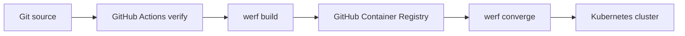

# Werf Demo

A small, deployable static web service that demonstrates Werf v3 building a container image from a Dockerfile and deploying it with a Helm chart. It includes a GitHub Actions validation workflow and a manually dispatched deployment workflow.

## Delivery Flow



## Prerequisites

- Docker Engine
- Helm 3 or later for local chart checks
- Werf v3 for Werf build and deployment commands
- A Kubernetes cluster and a container registry only for deployment

Install Werf using the current command shown in the [official getting-started guide](https://werf.io/getting_started/). The command verified for this project is:

```sh
curl -sSL https://werf.io/install.sh | bash -s -- --version 2 --channel stable
```

Start a new shell after installation, then verify it with `werf version`.

## Local Validation

```sh
helm lint .helm
helm template werf-demo .helm --namespace werf-demo-development

docker build --tag werf-demo-web:local .
docker run --rm --publish 8080:80 werf-demo-web:local
```

Open `http://localhost:8080` while the container is running.

To validate Werf's local image build without publishing to a registry:

```sh
werf build --dev
```

## Local Deployment

Authenticate to the target registry and Kubernetes cluster, then run:

```sh
werf cr login ghcr.io
werf converge --dev --repo ghcr.io/<github-owner>/werf-demo --env development
```

Werf builds and publishes the image as part of `converge`. To remove the release:

```sh
werf dismiss --env development
```

## GitHub Actions

[Verify](.github/workflows/verify.yml) runs on pull requests and pushes to `main`. It renders the chart and performs a local Werf development build.

[Deploy](.github/workflows/deploy.yml) is manual and targets either `development` or `staging`. Configure matching GitHub Environments and add this environment secret before running it:

| Secret | Purpose |
| --- | --- |
| `KUBE_CONFIG_BASE64` | Base64-encoded kubeconfig for the selected environment |

The deployment workflow uses GitHub's token to publish to GHCR. Ensure the repository workflow permissions permit package writes and the target cluster identity has only the permissions required by this namespace.

## Engineering Skills Adoption

This demo follows the shared [engineering skills](https://github.com/bansikah22/engineering-skills): its [technology-currency workflow](https://github.com/bansikah22/engineering-skills/blob/master/workflows/technology-currency.md) records current sources and pins CI actions and the container base image. See [AGENTS.md](AGENTS.md) and the project documents in [docs](docs).

## Official References

- [Werf project configuration](https://werf.io/docs/v3/usage/project_configuration/overview.html)
- [Werf build](https://werf.io/docs/v3/usage/build/overview.html)
- [Werf deploy](https://werf.io/docs/v3/usage/deploy/overview.html)
- [Werf GitHub Actions integration](https://werf.io/docs/v3/usage/integration_with_ci_cd_systems.html)
